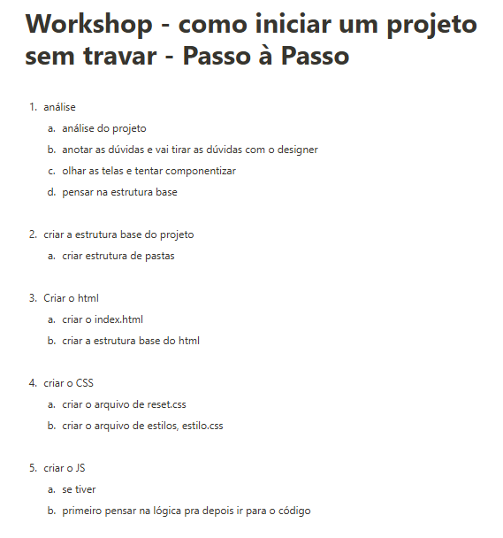

# Como criar um projeto do zero sem travar 
---
Este projeto foi desenvolvido durante as aulas do módulo de reforço CSS3 do curso Dev Start dos gêmeos. 

Abaixo segue as dicas mais importantes para o ínicio de qualquer projeto.

---
